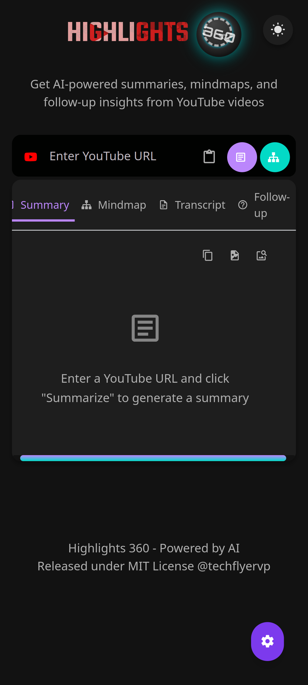

# Highlights 360 - YouTube Video Summarizer

Quickly get summaries, mind maps, and insights from YouTube videos using AI.

**Tags:** YouTube, AI, Summaries, Mind Maps, Google Gemini, Client-Side

## Table of Contents

- [Highlights 360 - YouTube Video Summarizer](#highlights-360---youtube-video-summarizer)
  - [Table of Contents](#table-of-contents)
  - [Overview](#overview)
  - [Features](#features)
  - [Requirements](#requirements)
  - [Setup \& Configuration](#setup--configuration)
  - [Usage Guide](#usage-guide)
  - [AI Models \& Prompts](#ai-models--prompts)
  - [Technical Details](#technical-details)
  - [License](#license)
  - [Contact](#contact)
  - [Acknowledgments](#acknowledgments)
  - [Limitations \& Future Improvements](#limitations--future-improvements)

## Overview

Highlights 360 helps you understand YouTube videos without watching the whole thing.
It uses AI (Google Gemini) to analyze whole videos or transcripts (depends on video-duration) and create:

*   **Summaries:** Short, clear overviews, with visual cues.
*   **Mind Maps:** Visual charts of ideas.
*   **Transcripts:** Full video text (with timestamps).
*   **Follow-up Insights:** AI answers to your questions about the video.

The app runs in your browser.
It uses external APIs for transcripts and AI.
This keeps your data private.

## Features

*   **Video Summaries:** Turn long videos into short summaries.
*   **Mind Maps:** Create visual maps of video content.
*   **Timestamped Transcripts:** Get full transcripts with clickable times.
*   **Follow-up Q&A:** Ask questions about the video and get AI answers.
*   **Dark/Light Theme:** Switch themes (light theme has known bugs).
*   **Export:** Save summaries, maps, and transcripts as JPG or copy text.
*   **Settings:** Set up AI models, API keys, prompts, and transcripts.
*   **Mobile-Focused Design:** Best used on mobile devices (Especially on apps).

## Requirements

You need these to use all features:

*   **Gemini API Key:** For AI summaries and mind maps.
*   **RapidAPI Key:** For YouTube transcripts.
*   **Modern Web Browser:** Chrome, Firefox, Safari, or Edge.
*   **Internet Connection:** For APIs and video loading.

*Note:* API keys are needed but not stored online.
They stay in your browser's local storage.

## Setup & Configuration

1.  **Get API Keys:**
    *   **Gemini API Key:**
        *   Go to [Google AI Studio](https://aistudio.google.com/).
        *   Sign in or create a Google account.
        *   Click "Get API key".
    *   **RapidAPI Key:**
        *   Sign up at [RapidAPI](https://rapidapi.com/) (or sign in with Google).
        *   Subscribe to the Basic plan for "YouTube Transcript" API [here](https://rapidapi.com/solid-api-solid-api-default/api/youtube-transcript3/pricing).
        *   Subscribe to the Basic plan for "YouTube v3" API [here](https://rapidapi.com/ytdlfree/api/youtube-v31/pricing).
        *   Copy your RapidAPI key from your dashboard.
2.  **Configure the App:**
    *   Click the settings icon (⚙️) (bottom right).
    *   Enter your Gemini and RapidAPI keys.
    *   Choose your Gemini model (or click "Refresh Models").
    *   Set optional fallback models (not tested), max video length, etc.
    *   Customize prompts if needed.
    *   Click "Save Settings".

**Important:** API keys are stored locally in your browser.
Be careful on shared computers.
You can clear this data in browser settings.

## Usage Guide

1.  **Basic Use:**
    *   Paste a YouTube URL or video ID.
    *   Click "Summarize" or "Mindmap".
    *   Wait for the progress indicator.
    *   Results appear in the tabs.
2.  **Working with Results:**
    *   **Tabs:** Switch between Summary, Mindmap, Transcript, Follow-up.
    *   **Timestamps:** Click times in transcripts/responses to jump in the video.
    *   **Copy:** Use the copy icon (📋) to copy text.
    *   **Export JPG:** Use the download icon (💾) to save as JPG.
    *   **View JPG:** Use the image icon (🖼️) to preview the JPG.
3.  **Follow-up Questions:**
    *   Go to the "Follow-up" tab.
    *   Type your question (e.g., "What was said about X?").
    *   Click "Ask".
    *   AI gives an answer based on the transcript.

## AI Models & Prompts

*   **AI Models:** Uses Google Gemini models (`gemini-pro`, `gemini-1.5-pro`).
    Others (OpenAI, Claude, etc.) need setup.
*   **Default Prompts:** Uses specific prompts for summaries, maps, and questions.
    Designed for structured Markdown output with timestamps.
*   **Customization:** Change prompts in settings.

## Technical Details

*   **Frontend:** HTML, CSS, JavaScript.
*   **Styling:** Tailwind CSS.
*   **Icons:** Material Design Icons.
*   **Content:** Marked.js (Markdown), DOMPurify (Security).
*   **Media:** html2canvas (JPG export).
*   **API:** Axios.
*   **Video:** YouTube iframe API.
*   **API Endpoints:**
    *   YouTube Transcript: `https://youtube-transcript3.p.rapidapi.com/api/transcript`
    *   YouTube Video Details: `https://youtube-v31.p.rapidapi.com/videos`
    *   Gemini API: `https://generativelanguage.googleapis.com/v1beta/models`
*   **Data Storage:** Uses browser `localStorage` for keys and settings.
    Session content (summaries, etc.) is not saved.

## License

Released under the [MIT License](https://opensource.org/licenses/MIT).

## Contact

Created by @techflyervp

## Acknowledgments

*   Google Gemini API
*   RapidAPI
*   YouTube iframe API

## Limitations & Future Improvements

*   **Limitations:** Very long videos might hit limits. Best for English.
    Basic fallback AI support. Needs internet.
*   **Future Ideas:** Better fallback models, save content,
    batch processing, more export formats (PDF, Markdown).

---

*This project was made with help of AI.*
